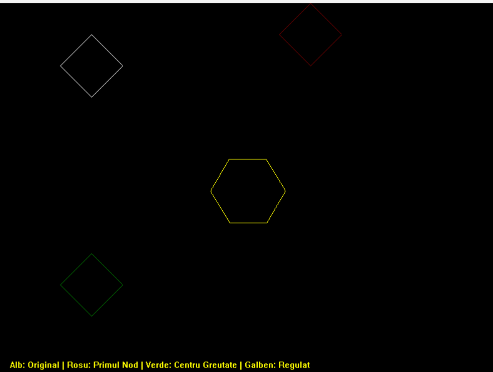

# Proiecte Grafica asistata pe calculator - C++ (WinBGI / graphics.h)

Acest repository conține colecția de aplicații și laboratoare dezvoltate pentru disciplina Grafică pe Calculator (Anul 2), folosind limbajul C++ și libraria winbgim (graphics.h).

## Structura Proiectului & Fișierele

### Laboratoare de Bază & Transformări 2D
* **manipulare_poligoane.cpp** - Încărcare de poligoane din fișiere externe, translatare în raport cu primul nod sau cu centrul de greutate și generare de poligoane regulate.  
   
* **hexagon_transformari.cpp** - Construirea unui hexagon regulat și aplicarea succesivă de transformări geometrice (translație, scalare).  
   
* **fagure.cpp** - Generarea unui ansamblu de hexagoane interconectate sub formă de fagure.  
   
* **rotatie_poligoane.cpp** - Algoritmi avansați pentru rotirea figurilor în jurul unui punct pivot arbitrar.  
   
* **oglindire_figura_dreapta.cpp** - Oglindirea unui obiect geometric și a diagonalei sale față de o dreaptă oarecare, utilizând matrici de transformare omogenă și inversare matricială.  
   

### Grafică Interactivă & Scene
* **grafic_valutar_interactiv.cpp** - Aplicație interactivă care citește date dintr-un fișier și desenează un grafic dinamic cu suport pentru zoom (+/-), navigare prin săgeți și ajustare pe axa verticală (W/S).  
   
* **roata_zimtata.cpp** - Gestionarea și transformarea unei scene complexe folosind liste înlănțuite alocate dinamic pentru poligoane și puncte.  
   
* **multiplicare_rotire_scena.cpp** - Multiplicarea figurilor prin translație și rotirea întregii scene.  
   
* **grafic_functie.cpp** - Desenarea unor funcții matematice în interiorul unui dreptunghi de decupare cu scalare.  
   
* **harta.cpp** - Aplicație de tip GMaps minimală cu viewport, translație din taste (W, A, S, D), zoom și rotire fără glitch-uri vizuale (double buffering).  
   

### Curbe, Fractali & Animații
* **curba_koch_pentagon.cpp** - Generarea fractalului Curba Koch aplicat pe laturile unui pentagon (3 iterații).  
   
* **elice_bezier.cpp** - Animație fluidă cu elice cu 3 pale desenate prin curbe Bezier cubice și rotație continuă.  
   
* **animatie_circuit.cpp** - Animația unei stele care se deplasează pe un circuit predefinit folosind dubla tamponare (XOR_PUT).  
   
* **animatie_functie_traiectorie.cpp** - Deplasarea animată a unei figuri de-a lungul unei traiectorii matematice (funcție exponențial-trigonometrică) cu detectarea intrării într-un careu de decupare.  
   

### Modelare 3D & Algoritmi pe Grilă
* **cub_sectionat_3d.cpp** - Proiecția și rotația în spațiu 3D (axe X și Y) a unui cub secționat reprezentat prin muchii wireframe.  
   
* **generare_coloana_3d.cpp** - Generator procedural care scrie într-un fișier `corp3d.txt` coordonatele și muchiile unei coloane 3D modulare.  
   
* **numarare_poligoane_grid.cpp** - Rasterizare pe careu folosind algoritmul lui Bresenham și un algoritm de urmărire a conturului (contour tracing) pentru identificarea și numărarea automată a poligoanelor.  
   

## Cum se rulează?
1. Proiectele necesită un mediu compatibil cu **Code::Blocks** și librăria **WinBGI / graphics.h** configurată.
2. Deschideți fișierul dorit `.cpp` în mediu, compilați și rulați.
